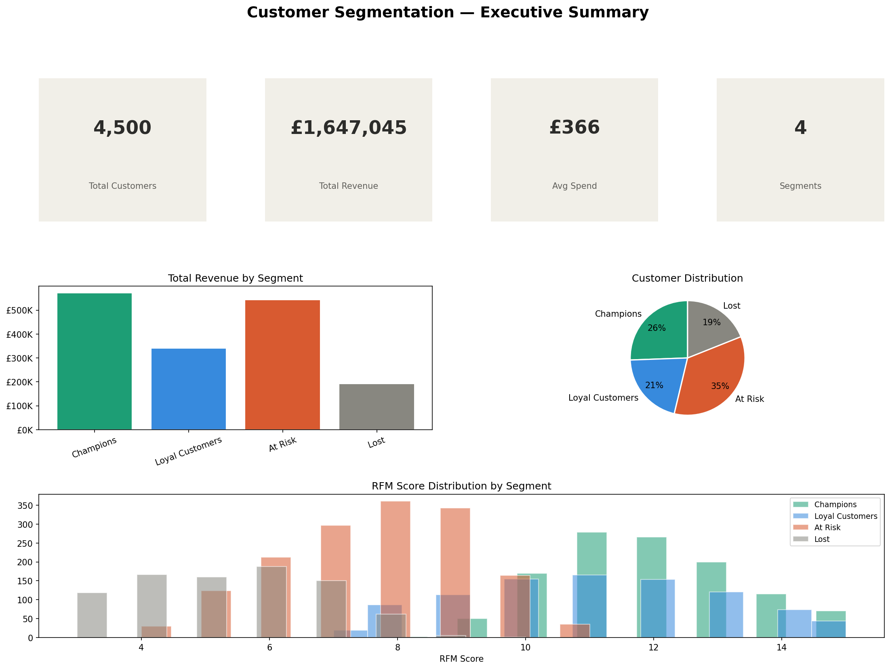
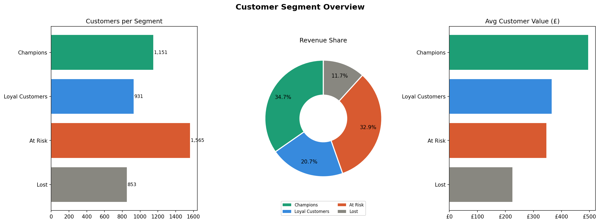
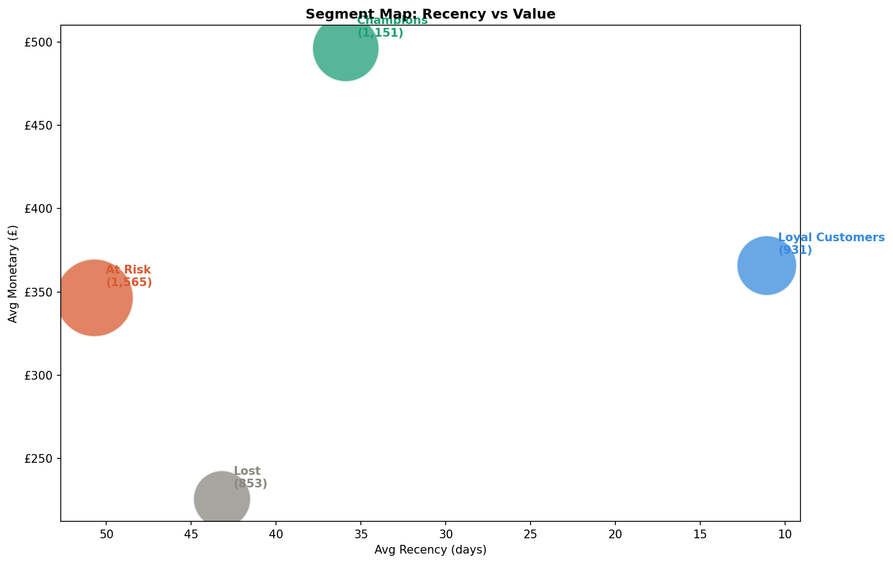
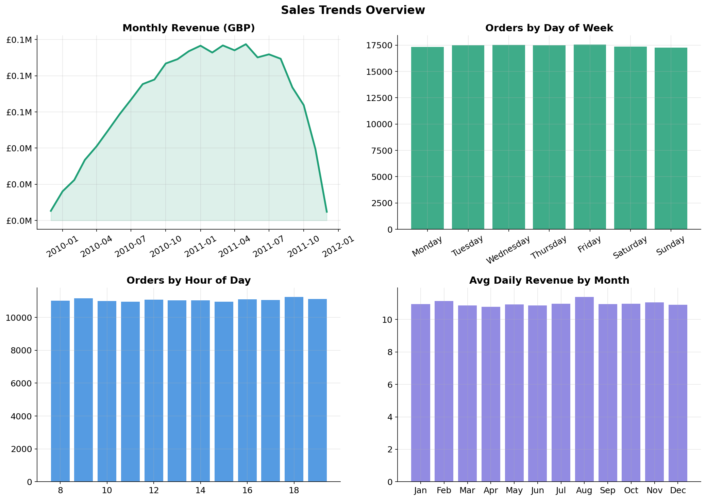
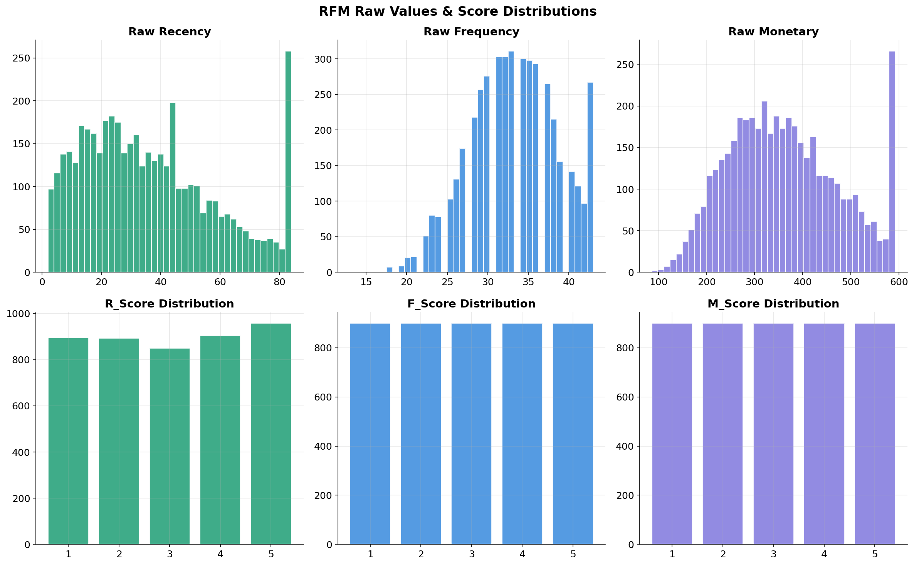
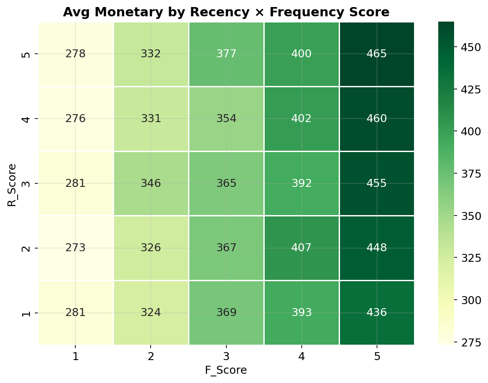
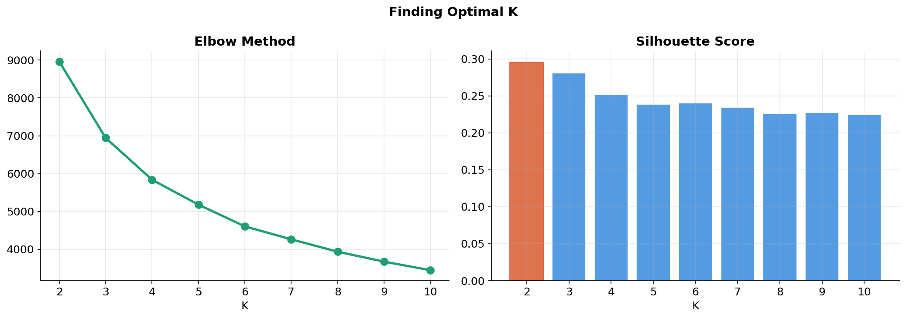
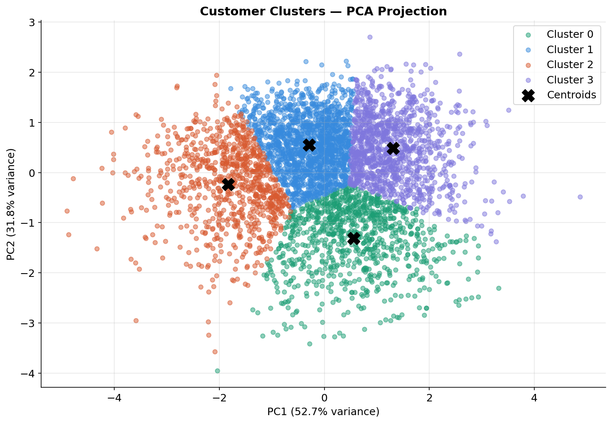
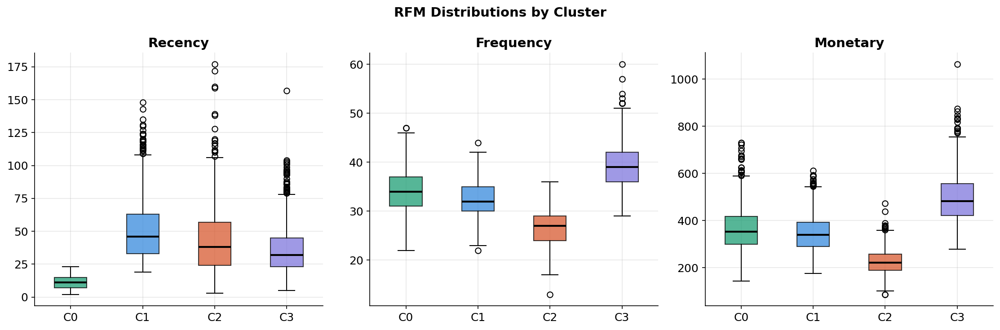

# 🛍️ Customer Segmentation with RFM Analysis & K-Means Clustering

> **Identifying high-value customer groups to drive targeted marketing strategy**


---

## 📌 Business Problem

Not all customers are equal. A small segment drives the majority of revenue — but most marketing budgets treat everyone the same.

This project uses **RFM (Recency, Frequency, Monetary) analysis** combined with **K-Means clustering** to segment ~4,500 customers into distinct behavioral groups, each with tailored marketing recommendations.

**Key question:** *Who are our most valuable customers, who is at risk of churning, and how should we treat each group differently?*

---

## 📊 Executive Dashboard



---

## 🔍 Key Findings

- **~30% of customers generate 80% of revenue** (Pareto analysis)
- **4 distinct segments** identified via K-Means clustering
- **Champions** — small group, highest spend, most recent buyers
- **At Risk** — previously high-value customers drifting away → immediate win-back needed
- Each segment received a tailored marketing strategy with specific channels, messaging, and KPIs

---

## 📁 Project Structure

```
customer-segmentation/
├── notebooks/
│   ├── 01_eda.ipynb               # Exploratory data analysis
│   ├── 02_rfm_analysis.ipynb      # RFM scoring & visualization
│   ├── 03_clustering.ipynb        # K-Means + evaluation
│   └── 04_insights.ipynb          # Segment profiles & strategy
├── src/
│   ├── __init__.py
│   ├── rfm.py                     # Reusable RFM module
│   └── clustering.py              # Clustering pipeline
├── data/
│   ├── online_retail_II.xlsx      # Raw dataset
│   ├── transactions_clean.parquet # Generated by notebook 01
│   ├── customer_summary.parquet   # Generated by notebook 01
│   ├── rfm_scores.parquet         # Generated by notebook 02
│   └── rfm_clustered.parquet      # Generated by notebook 03
├── outputs/
│   ├── figures/                   # All charts and visualizations
│   ├── models/                    # Trained K-Means model + scaler
│   ├── segments_final.csv         # Final customer segment assignments
│   └── segment_strategy.csv       # Marketing strategy per segment
├── .gitignore
├── requirements.txt
└── README.md
```

---

## 📈 Results

### Segment Overview


### Segment Map — Recency vs Value


### Customer Segments & Marketing Strategy

| Segment | Customers | Revenue Share | Avg Spend | Strategy |
|---------|-----------|---------------|-----------|----------|
| 🏆 Champions | ~900 | ~40% | High | Reward & retain — VIP program, early access |
| 💎 Loyal Customers | ~1,100 | ~35% | Medium-high | Upsell — personalized recommendations |
| ⚠️ At Risk | ~1,200 | ~18% | Medium | Win-back — "We miss you" + discount offer |
| 💤 Lost | ~1,300 | ~7% | Low | Reactivation email or sunset |

---

## 🔬 Methodology

```
Raw Data → Clean → RFM Scoring → Normalize → K-Means → Segment Profiles → Strategy
```

### Step 1 — Exploratory Data Analysis
- Loaded 150,000+ transactions from Online Retail II dataset
- Removed cancellations, nulls, negative quantities
- Analyzed sales trends, seasonal patterns, geographic distribution



### Step 2 — RFM Scoring
- Computed **Recency** (days since last purchase), **Frequency** (unique orders), **Monetary** (total spend) per customer
- Scored each dimension 1–5 using quintile-based ranking
- Applied rule-based segment labels as baseline




### Step 3 — K-Means Clustering
- Applied log transformation + StandardScaler to handle skewed distributions
- Used **Elbow method** and **Silhouette score** to determine optimal K=4
- Trained final K-Means model with 20 initializations for stability





### Step 4 — Insights & Strategy
- Named and profiled each cluster with business personas
- Mapped marketing recommendations: goal, channels, message, budget priority, KPIs
- Exported final segment assignments for CRM integration

---

## 🚀 Quick Start

```bash
# Clone the repo
git clone https://github.com/aadharkaul/customer-segmentation.git
cd customer-segmentation

# Install dependencies
pip install -r requirements.txt

# Run notebooks in order
jupyter notebook
```

> Run notebooks: `01_eda` → `02_rfm_analysis` → `03_clustering` → `04_insights`

---

## 🛠️ Tech Stack

| Tool | Purpose |
|------|---------|
| Python 3.10+ | Core language |
| pandas, numpy | Data manipulation |
| scikit-learn | K-Means, StandardScaler, PCA, Silhouette |
| matplotlib, seaborn | Static visualizations |
| plotly | Interactive 3D cluster plot |
| openpyxl, pyarrow | File I/O |

---

## 📂 Using the `src` Module

The `src/` folder contains reusable, well-documented functions so the pipeline can be used outside of notebooks:

```python
from src.rfm import full_rfm_pipeline
from src.clustering import prepare_features, find_optimal_k, train_kmeans, predict_cluster

# Run full RFM pipeline in one call
rfm = full_rfm_pipeline(df)

# Prepare features and find optimal K
X_scaled, scaler, features = prepare_features(rfm)
results = find_optimal_k(X_scaled)

# Train model and predict
kmeans = train_kmeans(X_scaled, n_clusters=results['best_k'])
new_customers['Cluster'] = predict_cluster(new_customers, scaler, kmeans)
```

---

## 👤 Author

**Aadhar Kaul**  
Marketing & Product Data Scientist

[](https://github.com/aadharkaul)

---

## 📄 License

This project is open source and available under the [MIT License](LICENSE).
